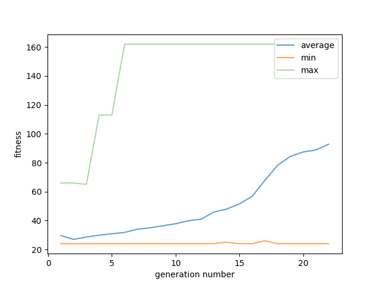

# Snail jumper
**Neuroevolution game assignment.**  
**Fall 2021 Computational Intelligence course.**  

In this project, a simple 2D minigame is implemented.
The agent needs to learn to jump when faced with obstacles using **neural network and evolutionary algorithm**.

# Example of Learning curve

# Contributors
[Soroush Mehraban](https://github.com/SoroushMehraban)  
Evolutionary Algorithm and neural network by [me](https://github.com/hedzd)
